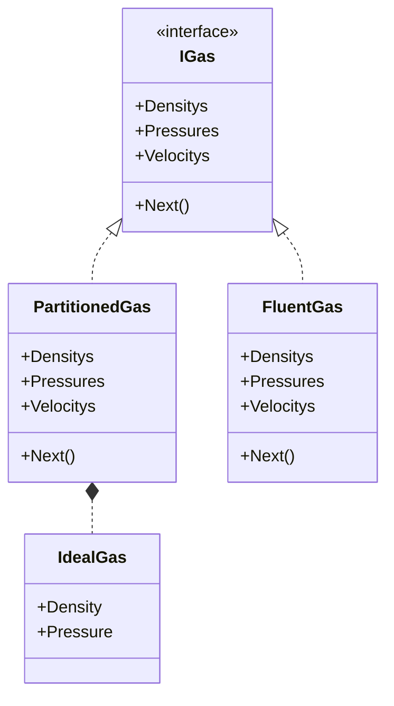

# RemovePartition

这是一个简单的求解欧拉方程的程序，界面使用WPF实现。

## 物理模型

一个气缸，初始状况下中间隔板可以左右移动，两侧气体遵循等温变化。

$t=0$ 时刻，移除隔板，此时气缸内的气体开始做无粘流动，程序开始仿真。

## 实现

### 类图

### 开始前

初始状态下采用恒温理想气体模型，满足 $\frac {p_1}{\rho_1}=\frac {p_2}{\rho_2}$ 。

隔板左右两侧的理想气体通过专门的 `IdealGas` 结构体来描述。

### 推进中

